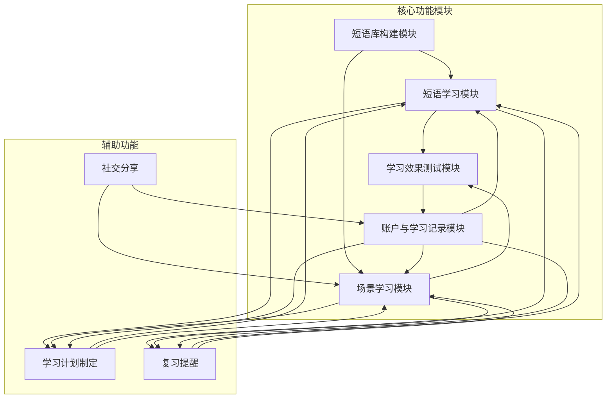
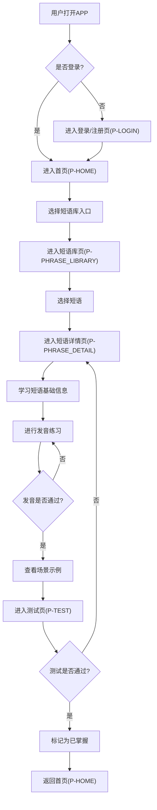
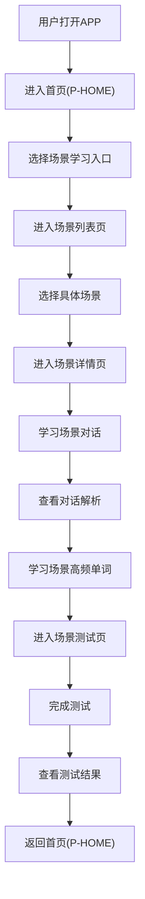
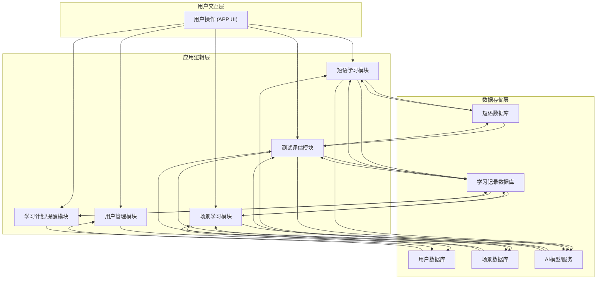

# 语习集APP产品需求文档

## 1. 产品概述

### 1.1 产品名称与定位

*   **产品名称:** 语习集
*   **产品定位:** 一款聚焦日常常用英文短语学习的AI驱动型移动端APP，旨在帮助用户高效掌握生活化英语短语，提升口语应用能力。
*   **产品应用语言:** 中文

### 1.2 产品愿景与目标

*   **产品愿景:** 成为用户提升日常英语口语能力的首选工具，让用户能够自信流利地在各种生活场景中运用英文短语。
*   **产品目标:**
    *   提供高频、实用的英文短语库，覆盖多种生活场景。
    *   通过AI技术实现精准发音纠正和个性化对话练习。
    *   建立完善的学习记录和复习机制，确保学习效果。
    *   提升用户学习英语的兴趣和效率，解决“学了不用”的痛点。

### 1.3 产品使用终端

*   **终端类型:** 移动端App (iOS & Android)

### 1.4 核心价值主张

*   **AI驱动的个性化学习:** 基于用户学习数据，智能推荐学习内容、生成对话场景，并提供精准发音反馈。
*   **聚焦实用短语:** 精选高频日常口语短语，避免生僻词汇，确保学习内容的实用性和高效性。
*   **沉浸式场景练习:** 通过真实对话模拟，帮助用户将所学短语应用于实际交流，提升口语应用能力。
*   **系统化学习与复习:** 结合学习计划、测试和复习提醒，形成完整的学习闭环。

### 1.5 目标用户群体分析

*   **学生:** 希望提升英语口语表达能力，应对日常交流和未来职场需求。
*   **职场新人:** 需要在工作环境中进行简单的英文沟通，或为职业发展做准备。
*   **出国旅游/定居人群:** 急需掌握旅行、生活场景中的实用短语，以便顺利交流。
*   **英语爱好者:** 对英语学习有持续热情，希望通过多样化方式提升口语水平。
*   **用户痛点:** 传统英语学习方式效率低、实用性不强；缺乏真实对话练习环境；发音不标准；难以坚持学习。

### 1.6 市场需求与竞品简析

*   **市场需求:** 随着全球化交流日益频繁，用户对实用英语口语能力的需求持续增长。传统应试教育难以满足实际应用需求，市场对个性化、场景化、高效的口语学习工具需求旺盛。AI技术的发展为解决这一痛点提供了新的可能。
*   **竞品简析:**
    *   **多邻国 (Duolingo):** 游戏化学习，覆盖全面但可能在口语深度上不足。
    *   **扇贝单词/百词斩:** 侧重词汇记忆，口语和短语应用方面较弱。
    *   **Cake/ELSA Speak:** 专注于发音纠正和听力，但在短语系统性学习和场景对话生成方面有所欠缺。
*   **语习集优势:** 专注于“日常常用英文短语”这一细分领域，结合AI技术提供个性化对话生成和精准发音纠正，形成差异化竞争优势。

## 2. 功能规格

### 2.1 功能详述

#### 2.1.1 短语库构建模块

| 功能ID | 功能名称 | 功能描述 | 优先级 |
|--------|---------|---------|--------|
| F-PHRASE_LIB_001 | 高频短语筛选 | AI筛选高频日常英文短语，覆盖问候、购物、点餐、出行、社交等生活场景，优先选择口语化、非书面化表达，避免生僻短语。 | P0 |
| F-PHRASE_LIB_002 | 短语难度分级 | 短语难度分为入门、进阶、精通三个等级，支持用户按难度筛选。 | P0 |
| F-PHRASE_LIB_003 | 短语基础信息配置 | 每个短语包含英文原句、中文精准释义（区分字面义与口语引申义）、标准发音音频（支持英式、美式两种发音切换）、发音要点提示（如连读、重音位置）、词性标注（如动词短语、介词短语）及使用场景标签（如「日常问候」「职场沟通」）。 | P0 |
| F-PHRASE_LIB_004 | 短语场景分类 | 短语按场景进行分类，方便用户查找和学习特定场景下的短语。 | P0 |
| F-PHRASE_LIB_005 | 短语例句展示 | 为每个短语提供2-3个日常口语场景示例，每个示例包含英文例句、中文翻译、示例对话的完整语音、示例使用场景说明。 | P0 |
| F-PHRASE_LIB_006 | 短语使用说明 | 提供短语的详细使用说明，包括适用语境、搭配、注意事项等。 | P0 |

#### 2.1.2 短语学习模块

| 功能ID | 功能名称 | 功能描述 | 优先级 |
|--------|---------|---------|--------|
| F-LEARN_001 | 递进式学习路径 | 用户选定短语后，APP展示「短语→发音→示例」的递进式学习路径。 | P0 |
| F-LEARN_002 | 发音训练与对比 | 支持用户录制自己的发音，AI通过语音识别技术对比用户发音与标准发音的差异，给出针对性纠音建议（如「重音应落在第二个音节」「注意连读现象」）。 | P0 |
| F-LEARN_003 | 场景示例展示 | 展示短语在不同场景下的示例对话，帮助用户理解短语的实际应用。 | P0 |
| F-LEARN_004 | 发音纠正 | 针对用户发音问题，提供即时、具体的纠正反馈。 | P0 |

#### 2.1.3 学习效果测试模块

| 功能ID | 功能名称 | 功能描述 | 优先级 |
|--------|---------|---------|--------|
| F-TEST_001 | 听力题 | 播放短语发音或示例对话，用户选择对应的英文短语/中文释义。 | P0 |
| F-TEST_002 | 发音题 | 用户朗读短语，AI评分并反馈发音问题。 | P0 |
| F-TEST_003 | 情景选择题 | 给出具体场景（如「在餐厅想加餐具」），用户选择最贴合的短语。 | P0 |
| F-TEST_004 | 测试结果判定 | 测试完成后，系统自动统计正确率，正确率≥80%判定为「学习完成」，低于80%则推荐重新学习该短语的薄弱点。 | P0 |

#### 2.1.4 账户与学习记录模块

| 功能ID | 功能名称 | 功能描述 | 优先级 |
|--------|---------|---------|--------|
| F-ACCOUNT_001 | 多账号登录 | 支持手机号/第三方账号（微信、QQ）登录，登录后自动关联用户学习数据。 | P0 |
| F-ACCOUNT_002 | 学习数据记录 | 系统记录用户已学短语列表（含学习时间、掌握状态：未掌握/已掌握）、测试历史成绩、发音练习记录。 | P0 |
| F-ACCOUNT_003 | 学习数据筛选 | 支持用户按「学习时间」「场景标签」「掌握状态」筛选已学短语，方便复习巩固。 | P0 |
| F-ACCOUNT_004 | 学习数据统计 | 提供用户学习时长、掌握短语数量、测试正确率等数据统计，可视化展示学习成果。 | P0 |

#### 2.1.5 场景学习模块

| 功能ID | 功能名称 | 功能描述 | 优先级 |
|--------|---------|---------|--------|
| F-SCENE_LEARN_001 | 场景分类 | 提供3类核心场景：日常场景（问候、点餐、购物、问路等）、职场场景（自我介绍、面试问答等）、留学/考试场景（雅思口语part1、留学面签等）。 | P0 |
| F-SCENE_LEARN_002 | 场景标识 | 每个场景清晰标注难度（入门/进阶）、学习时长（统一标注10分钟）。 | P0 |
| F-SCENE_LEARN_003 | 场景入口 | 支持场景分类浏览、关键词搜索功能；用户点击目标场景后直接跳转至场景学习环节。 | P0 |
| F-SCENE_LEARN_004 | 对话内容及解析 | 每个场景提供高频对话（配套文本+音频），对话控制在10回合内；针对核心问答提供详细解析，明确同个问题的2-3种不同回答内容。 | P0 |
| F-SCENE_LEARN_005 | 对话呈现 | 支持高频对话文本、同问题不同回答解析文本的清晰展示；同时支持对应音频播放。 | P0 |
| F-SCENE_LEARN_006 | 场景高频单词 | 提取场景高频对话中出现的核心高频单词，提供单词基础信息（音标、中文释义、对话中原句）。 | P0 |
| F-SCENE_LEARN_007 | 场景测试 | 提供基础文本选择题、问答题、开放式对话测试，系统自动判定回答是否正确，记录相关数据并分析对话质量。 | P0 |

#### 2.1.6 辅助功能

| 功能ID | 功能名称 | 功能描述 | 优先级 |
|--------|---------|---------|--------|
| F-AUX_001 | 学习计划制定 | AI根据用户的学习时长、测试成绩，自动推荐每日/每周短语学习目标（如「每日学习5个出行类短语」）。 | P0 |
| F-AUX_002 | 复习提醒 | 基于艾宾浩斯遗忘曲线，在用户容易遗忘的时间点推送复习提醒。 | P0 |
| F-AUX_004 | 社交分享 | 支持用户将学习成果、测试成绩、有趣的对话等分享至社交媒体。 | P0 |

### 2.2 功能模块间的关系图

## 3. 用户流程

### 3.1 用户旅程地图

| 阶段 | 用户目标 | 用户行为 | 系统响应 | 痛点/机会点 |
|------|----------|----------|----------|-------------|
| **发现与兴趣** | 了解产品，产生学习兴趣 | 看到广告/推荐，下载APP | 展示产品核心价值，引导注册/登录 | 痛点：传统学习枯燥。机会：突出AI和场景化优势。 |
| **首次使用** | 快速上手，体验核心功能 | 注册/登录，浏览首页，尝试学习一个短语 | 引导式教程，推荐入门短语，展示学习流程 | 痛点：功能复杂，不知从何开始。机会：简洁的引导和清晰的学习路径。 |
| **日常学习** | 掌握新短语，提升口语 | 选择短语学习，进行发音练习，查看示例，完成测试 | 提供发音反馈，展示示例，自动评分，记录学习进度 | 痛点：发音不准，缺乏练习环境。机会：AI纠音和场景示例。 |
| **巩固复习** | 复习已学内容，避免遗忘 | 查看学习记录，进行复习测试，参与对话练习 | 推荐薄弱点，提供复习材料，生成个性化对话 | 痛点：容易遗忘，复习效率低。机会：智能复习提醒和个性化对话。 |
| **成果检验** | 检验学习效果，获得成就感 | 查看学习数据，分享学习成果 | 展示学习报告，支持社交分享 | 痛点：学习效果不明显。机会：可视化数据和分享激励。 |
| **持续使用** | 保持学习动力，持续提升 | 接收复习提醒，完成每日学习计划，探索新功能 | 推送提醒，更新内容，优化体验 | 痛点：学习动力不足。机会：激励机制和内容更新。 |

### 3.2 关键路径流程图

#### 3.2.1 核心学习流程

#### 3.2.2 场景学习流程

### 3.3 各场景下的用户操作步骤

#### 3.3.1 学习新短语

1.  **用户操作:** 打开语习集APP，进入首页（P-HOME）。
2.  **用户操作:** 点击“短语库”入口，进入短语库页（P-PHRASE_LIBRARY）。
3.  **用户操作:** 浏览或筛选短语，点击选择一个感兴趣的短语。
4.  **系统响应:** 跳转至短语详情页（P-PHRASE_DETAIL），展示短语基本信息、发音、示例等。
5.  **用户操作:** 点击“发音练习”按钮，进入发音练习模式。
6.  **用户操作:** 录制自己的发音。
7.  **系统响应:** AI进行发音对比，给出纠音建议。
8.  **用户操作:** 根据建议反复练习，直至发音通过。
9.  **用户操作:** 点击“查看示例”按钮，浏览短语在不同场景下的示例对话。
10. **用户操作:** 点击“开始测试”按钮，进入测试页（P-TEST）。
11. **用户操作:** 完成听力、发音、情景选择题。
12. **系统响应:** 自动统计测试结果，若正确率≥80%，则标记该短语为“已掌握”，并更新学习记录。
13. **用户操作:** 返回首页（P-HOME）。

#### 3.3.2 进行场景学习

1.  **用户操作:** 打开语习集APP，进入首页（P-HOME）。
2.  **用户操作:** 点击“场景学习”入口，进入场景列表页。
3.  **系统响应:** 显示场景分类列表（日常场景、职场场景、留学/考试场景）。
4.  **用户操作:** 选择一个场景分类。
5.  **系统响应:** 显示该分类下的具体场景列表，每个场景标注难度和学习时长。
6.  **用户操作:** 点击选择一个感兴趣的场景。
7.  **系统响应:** 跳转至场景详情页，展示场景对话内容、解析和高频单词。
8.  **用户操作:** 学习场景对话，查看对话解析，收听音频。
9.  **用户操作:** 浏览场景高频单词，了解单词基础信息。
10. **用户操作:** 点击“开始测试”按钮，进入场景测试页。
11. **用户操作:** 完成基础文本选择题、问答题和开放式对话测试。
12. **系统响应:** 自动统计测试结果，生成测试分析报告。
13. **用户操作:** 查看测试分析报告，了解学习效果。
14. **用户操作:** 返回首页（P-HOME）。

## 4. 数据流设计

### 4.1 数据结构与关系

*   **用户 (User):**
    *   `user_id` (PK)
    *   `phone_number`
    *   `wechat_id`
    *   `qq_id`
    *   `registration_date`
    *   `last_login_date`
*   **短语 (Phrase):**
    *   `phrase_id` (PK)
    *   `english_text`
    *   `chinese_definition_literal`
    *   `chinese_definition_colloquial`
    *   `part_of_speech`
    *   `difficulty_level` (入门, 进阶, 精通)
    *   `pronunciation_audio_url_en`
    *   `pronunciation_audio_url_us`
    *   `pronunciation_tips`
*   **短语场景 (PhraseScene):**
    *   `scene_id` (PK)
    *   `scene_name` (如：日常问候, 购物, 点餐)
*   **短语-场景关联 (PhraseSceneRelation):**
    *   `phrase_id` (FK)
    *   `scene_id` (FK)
*   **短语示例 (PhraseExample):**
    *   `example_id` (PK)
    *   `phrase_id` (FK)
    *   `english_example`
    *   `chinese_translation`
    *   `example_audio_url`
    *   `usage_scenario_description`
*   **用户学习记录 (UserLearningRecord):**
    *   `record_id` (PK)
    *   `user_id` (FK)
    *   `phrase_id` (FK)
    *   `learning_date`
    *   `mastery_status` (未掌握, 已掌握)
    *   `last_practice_date`
*   **用户发音练习记录 (UserPronunciationRecord):**
    *   `pronunciation_id` (PK)
    *   `user_id` (FK)
    *   `phrase_id` (FK)
    *   `practice_date`
    *   `ai_feedback` (JSON格式，包含发音问题、建议等)
    *   `score` (AI评分)
*   **用户测试记录 (UserTestRecord):**
    *   `test_id` (PK)
    *   `user_id` (FK)
    *   `test_date`
    *   `total_score`
    *   `correct_count`
    *   `incorrect_count`
    *   `test_type` (听力, 发音, 情景选择)
*   **场景分类 (SceneCategory):**
    *   `category_id` (PK)
    *   `category_name` (日常场景、职场场景、留学/考试场景)
*   **场景 (Scene):**
    *   `scene_id` (PK)
    *   `scene_name`
    *   `category_id` (FK)
    *   `difficulty_level` (入门, 进阶)
    *   `learning_duration` (统一标注10分钟)
    *   `description`
*   **场景对话 (SceneDialogue):**
    *   `dialogue_id` (PK)
    *   `scene_id` (FK)
    *   `dialogue_text`
    *   `dialogue_audio_url`
    *   `dialogue_order`
*   **场景对话解析 (SceneDialogueAnalysis):**
    *   `analysis_id` (PK)
    *   `dialogue_id` (FK)
    *   `question_text`
    *   `answer_variations` (JSON格式，包含2-3种不同回答)
    *   `analysis_content`
*   **场景高频单词 (SceneHighFrequencyWord):**
    *   `word_id` (PK)
    *   `scene_id` (FK)
    *   `word_text`
    *   `phonetic`
    *   `chinese_definition`
    *   `original_sentence`
*   **场景测试题 (SceneTestQuestion):**
    *   `question_id` (PK)
    *   `scene_id` (FK)
    *   `question_type` (选择题, 问答题, 开放式对话)
    *   `question_content`
    *   `options` (JSON格式，选择题选项)
    *   `standard_answer`
*   **用户场景学习记录 (UserSceneLearningRecord):**
    *   `record_id` (PK)
    *   `user_id` (FK)
    *   `scene_id` (FK)
    *   `learning_date`
    *   `mastery_status` (未掌握, 已掌握)
    *   `test_score`
    *   `learning_progress`
*   **学习计划 (StudyPlan):**
    *   `plan_id` (PK)
    *   `user_id` (FK)
    *   `plan_date`
    *   `target_phrases_count`
    *   `target_scene`
    *   `status` (未完成, 已完成)

### 4.2 关键数据流向图

### 4.3 数据存储与处理原则

1.  **数据安全性:** 所有用户数据（包括个人信息、学习记录、发音音频、对话记录）均需加密存储和传输，严格遵守数据隐私保护法规。
2.  **数据一致性:** 确保用户学习进度、掌握状态等核心数据在不同模块间保持一致。
3.  **数据实时性:** AI发音反馈、对话生成、测试结果等需具备高实时性，确保用户获得即时响应。
4.  **数据可扩展性:** 数据模型设计需考虑未来功能扩展和数据量增长的需求。
6.  **AI模型优化:** 定期收集用户发音、对话数据，用于优化AI语音识别、合成和对话生成模型，提升准确性和自然度。

## 5. 页面规格

### 5.1 页面概览

| 页面ID | 页面名称 | 核心功能 |
|--------|---------|---------|
| P-HOME | 首页 | 学习进度展示、场景学习入口、场景分类入口、复习提醒、学习计划入口、搜索功能 |
| P-PHRASE_LIBRARY | 短语库页 | 短语浏览、筛选、搜索 |
| P-PHRASE_DETAIL | 短语详情页 | 短语学习、发音练习、场景示例、测试入口、收藏、分享 |
| P-TEST | 测试页 | 听力、发音、情景选择题测试 |
| P-LEARNING_RECORD | 学习记录页 | 已学短语列表、学习数据统计、筛选 |
| P-SCENE_LIST | 场景列表页 | 场景分类浏览、场景搜索、场景筛选 |
| P-SCENE_DETAIL | 场景详情页 | 场景对话学习、对话解析、高频单词学习、测试入口 |
| P-SCENE_TEST | 场景测试页 | 场景相关的选择题、问答题、开放式对话测试 |
| P-USER_PROFILE | 个人中心页 | 账户信息、学习数据概览、设置入口 |
| P-SETTINGS | 设置页 | 应用通用设置、离线管理、通知设置 |
| P-LOGIN | 登录/注册页 | 用户身份验证 |
| P-STUDY_PLAN | 学习计划页 | 学习目标展示、计划详情 |
| P-REVIEW_REMINDER | 复习提醒页 | 复习任务列表、提醒设置 |
| P-OFFLINE_MANAGE | 离线管理页 | 离线内容下载与管理 |
| P-SHARE | 分享页 | 学习成果分享 |

### 5.2 页面详情

#### 5.2.1 首页（P-HOME）

*   **页面名称与目的:** 首页，作为用户进入APP后的主要入口，提供学习概览、核心功能导航和个性化推荐。
*   **页面负责的核心功能:** 展示学习进度、场景学习入口、提供场景分类入口、复习提醒、学习计划入口、搜索功能。
*   **主要UI元素与布局建议:**
    *   顶部：搜索框、个人中心入口。
    *   中部：学习进度卡片（已学短语数、掌握率）、今日学习目标、复习提醒卡片。
    *   下方：场景学习模块（卡片式）、场景分类入口（图标+文字）、底部导航栏（首页、短语库、我的）。
*   **页面需展示的关键数据:**
    *   用户头像、昵称。
    *   已学习短语总数、已掌握短语数、学习总时长。
    *   推荐学习场景。
    *   待复习短语数量。
    *   场景分类列表。

#### 5.2.2 短语库页（P-PHRASE_LIBRARY）

*   **页面名称与目的:** 短语库页，集中展示所有短语，支持用户按难度、场景进行筛选和搜索。
*   **页面负责的核心功能:** 短语浏览、筛选、搜索。
*   **主要UI元素与布局建议:**
    *   顶部：搜索框、筛选按钮（难度、场景）。
    *   中部：短语列表（卡片或列表形式，显示短语英文、中文释义、难度、场景标签）。
    *   底部：底部导航栏。
*   **页面需展示的关键数据:**
    *   短语列表（英文、中文释义、难度、场景）。
    *   筛选条件（难度、场景）。

#### 5.2.3 短语详情页（P-PHRASE_DETAIL）

*   **页面名称与目的:** 短语详情页，展示单个短语的详细信息，并提供发音练习、场景示例、测试入口、收藏和分享功能。
*   **页面负责的核心功能:** 短语学习、发音练习、场景示例、测试入口、收藏、分享。
*   **主要UI元素与布局建议:**
    *   顶部：返回按钮、收藏按钮、分享按钮。
    *   中部：短语英文原句、中文释义、发音音频播放器（英式/美式切换）、发音要点提示、词性标注、使用场景标签。
    *   下方：发音练习区域（录音按钮、AI反馈区）、场景示例列表（可展开/收起）、测试入口按钮。
*   **页面需展示的关键数据:**
    *   短语英文原句、中文释义。
    *   发音音频、发音要点。
    *   词性、场景标签。
    *   场景示例（英文例句、中文翻译、示例音频、使用说明）。
    *   AI发音反馈。

#### 5.2.4 测试页（P-TEST）

*   **页面名称与目的:** 测试页，用于检验用户对已学短语的掌握程度，提供听力、发音、情景选择题。
*   **页面负责的核心功能:** 听力、发音、情景选择题测试。
*   **主要UI元素与布局建议:**
    *   顶部：返回按钮、测试进度（如：1/5）。
    *   中部：题目区域（根据题型动态变化）。
        *   听力题：音频播放器、选项列表。
        *   发音题：录音按钮、AI反馈区。
        *   情景选择题：场景描述、选项列表。
    *   底部：提交/下一题按钮。
*   **页面需展示的关键数据:**
    *   题目内容、选项。
    *   音频播放器。
    *   录音状态、AI发音反馈。
    *   测试进度。

#### 5.2.5 学习记录页（P-LEARNING_RECORD）

*   **页面名称与目的:** 学习记录页，展示用户的学习历史、已学短语列表和学习数据统计。
*   **页面负责的核心功能:** 已学短语列表、学习数据统计、筛选。
*   **主要UI元素与布局建议:**
    *   顶部：返回按钮、筛选按钮（按学习时间、场景、掌握状态）。
    *   中部：学习数据统计图表（如：掌握率趋势、每日学习时长）、已学短语列表（显示短语、掌握状态、学习日期）。
    *   底部：底部导航栏。
*   **页面需展示的关键数据:**
    *   已学短语总数、已掌握短语数、学习总时长。
    *   学习趋势图表。
    *   已学短语列表（英文、中文释义、掌握状态、学习日期）。

#### 5.2.6 场景列表页（P-SCENE_LIST）

*   **页面名称与目的:** 场景列表页，展示所有场景分类和具体场景，支持用户按分类浏览和搜索场景。
*   **页面负责的核心功能:** 场景分类浏览、场景搜索、场景筛选。
*   **主要UI元素与布局建议:**
    *   顶部：返回按钮、搜索框。
    *   中部：场景分类标签栏、场景列表（卡片式，显示场景名称、难度、学习时长）。
    *   底部：底部导航栏。
*   **页面需展示的关键数据:**
    *   场景分类列表。
    *   场景名称、难度、学习时长。

#### 5.2.7 场景详情页（P-SCENE_DETAIL）

*   **页面名称与目的:** 场景详情页，展示场景对话内容、解析和高频单词，提供场景学习的核心内容。
*   **页面负责的核心功能:** 场景对话学习、对话解析、高频单词学习、测试入口。
*   **主要UI元素与布局建议:**
    *   顶部：返回按钮、分享按钮。
    *   中部：场景标题、难度、学习时长、对话内容（文本+音频播放器）、对话解析（同问题不同回答）。
    *   下方：场景高频单词列表、开始测试按钮。
*   **页面需展示的关键数据:**
    *   场景对话文本、音频。
    *   对话解析内容（同问题不同回答）。
    *   场景高频单词（音标、中文释义、原句）。

#### 5.2.8 场景测试页（P-SCENE_TEST）

*   **页面名称与目的:** 场景测试页，用于检验用户对场景学习内容的掌握程度，提供多种类型的测试题。
*   **页面负责的核心功能:** 场景相关的选择题、问答题、开放式对话测试。
*   **主要UI元素与布局建议:**
    *   顶部：返回按钮、测试进度。
    *   中部：题目区域（根据题型动态变化）。
        *   选择题：题目描述、选项列表。
        *   问答题：题目描述、录音按钮、AI反馈区。
        *   开放式对话：对话场景描述、语音输入按钮、对话气泡。
    *   底部：提交/下一题按钮。
*   **页面需展示的关键数据:**
    *   测试题目内容、选项。
    *   录音状态、AI发音反馈。
    *   对话内容、AI回应。

#### 5.2.9 个人中心页（P-USER_PROFILE）

*   **页面名称与目的:** 个人中心页，展示用户个人信息、学习数据概览，并提供设置入口。
*   **页面负责的核心功能:** 账户信息、学习数据概览、设置入口。
*   **主要UI元素与布局建议:**
    *   顶部：用户头像、昵称、UID。
    *   中部：学习数据概览（如：总学习时长、掌握短语数、测试平均分）、功能入口列表（学习记录、学习计划、复习提醒、设置）。
    *   底部：底部导航栏。
*   **页面需展示的关键数据:**
    *   用户头像、昵称。
    *   总学习时长、掌握短语数、测试平均分。

#### 5.2.10 设置页（P-SETTINGS）

*   **页面名称与目的:** 设置页，提供应用通用设置，如通知设置、隐私政策、关于我们等。
*   **页面负责的核心功能:** 应用通用设置、通知设置。
*   **主要UI元素与布局建议:**
    *   顶部：返回按钮、页面标题。
    *   中部：设置项列表（如：通知设置、隐私政策、用户协议、关于我们、版本信息）。
*   **页面需展示的关键数据:**
    *   应用版本号。

#### 5.2.11 登录/注册页（P-LOGIN）

*   **页面名称与目的:** 登录/注册页，提供用户身份验证功能。
*   **页面负责的核心功能:** 用户身份验证。
*   **主要UI元素与布局建议:**
    *   顶部：应用Logo、应用名称。
    *   中部：手机号输入框、密码输入框、验证码输入框、登录/注册按钮、第三方登录按钮（微信、QQ）。
    *   底部：用户协议和隐私政策链接。
*   **页面需展示的关键数据:**
    *   无。

#### 5.2.12 学习计划页（P-STUDY_PLAN）

*   **页面名称与目的:** 学习计划页，展示AI推荐的学习目标和计划详情。
*   **页面负责的核心功能:** 学习目标展示、计划详情。
*   **主要UI元素与布局建议:**
    *   顶部：返回按钮、页面标题。
    *   中部：今日/本周学习目标卡片、已完成进度、推荐学习短语列表。
*   **页面需展示的关键数据:**
    *   推荐学习目标（如：每日学习5个出行类短语）。
    *   已完成进度。
    *   推荐学习短语列表。

#### 5.2.13 复习提醒页（P-REVIEW_REMINDER）

*   **页面名称与目的:** 复习提醒页，展示待复习的短语列表和复习任务。
*   **页面负责的核心功能:** 复习任务列表、提醒设置。
*   **主要UI元素与布局建议:**
    *   顶部：返回按钮、页面标题。
    *   中部：待复习短语列表（显示短语、上次学习时间、掌握状态）、复习提醒设置开关。
*   **页面需展示的关键数据:**
    *   待复习短语列表。
    *   复习提醒开关状态。

*   **页面名称与目的:** 分享页，提供用户将学习成果、测试成绩、有趣的对话等分享至社交媒体的功能。
*   **页面负责的核心功能:** 学习成果分享。
*   **主要UI元素与布局建议:**
    *   顶部：返回按钮、页面标题。
    *   中部：分享内容预览（如：短语卡片、测试成绩截图、对话摘要）、分享渠道图标列表（微信、QQ、朋友圈、微博等）。
*   **页面需展示的关键数据:**
    *   待分享内容。
