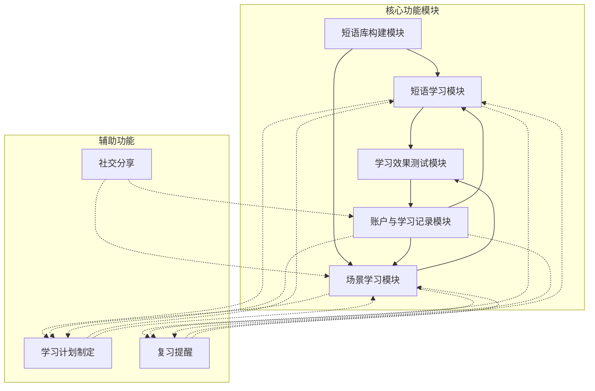
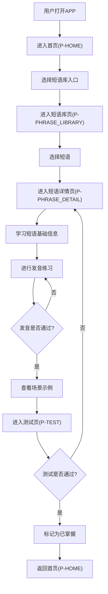
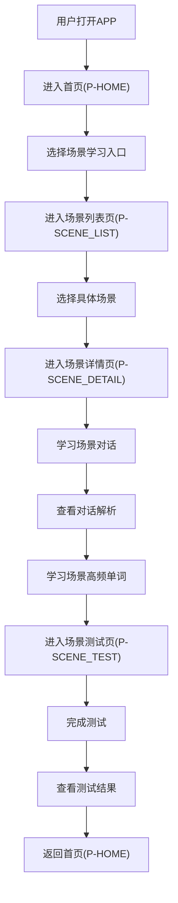
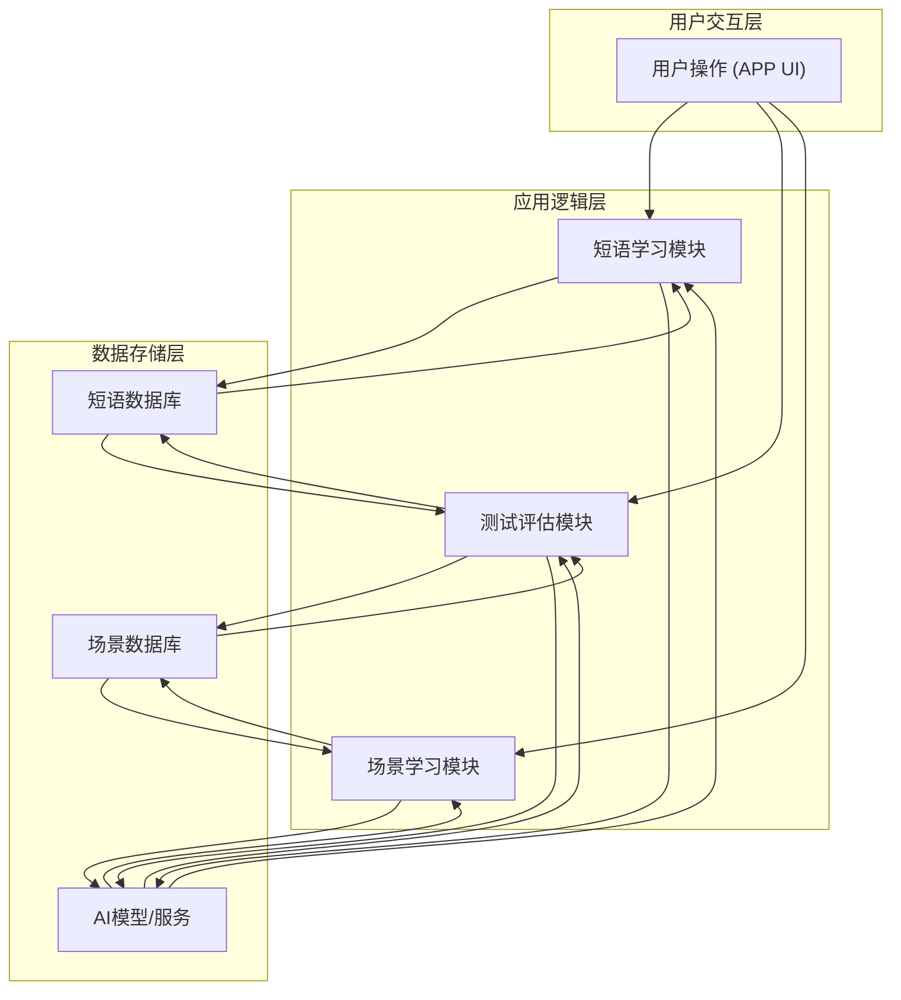

# 语习集APP产品需求文档

## 1. 产品概述

### 1.1 产品名称与定位

*   **产品名称:** 语习集
*   **产品定位:** 一款聚焦日常常用英文短语学习的AI驱动型移动端APP，旨在帮助用户高效掌握生活化英语短语，提升口语应用能力。
*   **产品应用语言:** 中文

### 1.2 产品愿景与目标

*   **产品愿景:** 成为用户提升日常英语口语能力的首选工具，让用户能够自信流利地在各种生活场景中运用英文短语。
*   **产品目标:**
    *   提供高频、实用的英文短语库，覆盖多种生活场景。
    *   通过AI技术实现精准发音纠正和个性化对话练习。
    *   建立完善的学习记录和复习机制，确保学习效果。
    *   提升用户学习英语的兴趣和效率，解决"学了不用"的痛点。

### 1.3 产品使用终端

*   **终端类型:** 移动端App (iOS & Android)

### 1.4 核心价值主张

*   **AI驱动的个性化学习:** 基于用户学习数据，智能推荐学习内容、生成对话场景，并提供精准发音反馈。
*   **聚焦实用短语:** 精选高频日常口语短语，避免生僻词汇，确保学习内容的实用性和高效性。
*   **沉浸式场景练习:** 通过真实对话模拟，帮助用户将所学短语应用于实际交流，提升口语应用能力。
*   **系统化学习与复习:** 结合学习计划、测试和复习提醒，形成完整的学习闭环。

### 1.5 目标用户群体分析

*   **学生:** 希望提升英语口语表达能力，应对日常交流和未来职场需求。
*   **职场新人:** 需要在工作环境中进行简单的英文沟通，或为职业发展做准备。
*   **出国旅游/定居人群:** 急需掌握旅行、生活场景中的实用短语，以便顺利交流。
*   **英语爱好者:** 对英语学习有持续热情，希望通过多样化方式提升口语水平。
*   **用户痛点:** 传统英语学习方式效率低、实用性不强；缺乏真实对话练习环境；发音不标准；难以坚持学习。

### 1.6 市场需求与竞品简析

*   **市场需求:** 随着全球化交流日益频繁，用户对实用英语口语能力的需求持续增长。传统应试教育难以满足实际应用需求，市场对个性化、场景化、高效的口语学习工具需求旺盛。AI技术的发展为解决这一痛点提供了新的可能。
*   **竞品简析:**
    *   **多邻国 (Duolingo):** 游戏化学习，覆盖全面但可能在口语深度上不足。
    *   **扇贝单词/百词斩:** 侧重词汇记忆，口语和短语应用方面较弱。
    *   **Cake/ELSA Speak:** 专注于发音纠正和听力，但在短语系统性学习和场景对话生成方面有所欠缺。
*   **语习集优势:** 专注于"日常常用英文短语"这一细分领域，结合AI技术提供个性化对话生成和精准发音纠正，形成差异化竞争优势。

---

## 2. 功能规格

### 2.1 功能详述

#### 2.1.1 短语库构建模块

| 功能ID | 功能名称 | 功能描述 | 优先级 | 实现状态 |
|--------|---------|---------|--------|----------|
| F-PHRASE_LIB_001 | 高频短语筛选 | AI筛选高频日常英文短语，覆盖问候、购物、点餐、出行、社交等生活场景，优先选择口语化、非书面化表达，避免生僻短语。 | P0 | ✅ 已实现 |
| F-PHRASE_LIB_002 | 短语难度分级 | 短语难度分为入门、进阶、精通三个等级，支持用户按难度筛选。 | P0 | ✅ 已实现 |
| F-PHRASE_LIB_003 | 短语基础信息配置 | 每个短语包含英文原句、中文精准释义（区分字面义与口语引申义）、标准发音音频（支持英式、美式两种发音切换）、发音要点提示（如连读、重音位置）、词性标注（如动词短语、介词短语）及使用场景标签（如「日常问候」「职场沟通」）。 | P0 | ⚠️ 部分实现（暂不支持英美发音切换） |
| F-PHRASE_LIB_004 | 短语场景分类 | 短语按场景进行分类，方便用户查找和学习特定场景下的短语。 | P0 | ✅ 已实现 |
| F-PHRASE_LIB_005 | 短语例句展示 | 为每个短语提供2-3个日常口语场景示例，每个示例包含英文例句、中文翻译、示例对话的完整语音、示例使用场景说明。 | P0 | ⚠️ 基础实现 |
| F-PHRASE_LIB_006 | 短语使用说明 | 提供短语的详细使用说明，包括适用语境、搭配、注意事项等。 | P0 | ⚠️ 基础实现 |

#### 2.1.2 短语学习模块

| 功能ID | 功能名称 | 功能描述 | 优先级 | 实现状态 |
|--------|---------|---------|--------|----------|
| F-LEARN_001 | 递进式学习路径 | 用户选定短语后，APP展示「短语→发音→示例」的递进式学习路径。 | P0 | ⚠️ 基础实现 |
| F-LEARN_002 | 发音训练与对比 | 支持用户录制自己的发音，AI通过语音识别技术对比用户发音与标准发音的差异，给出针对性纠音建议（如「重音应落在第二个音节」「注意连读现象」）。 | P0 | ⚠️ 基础实现（AI评分） |
| F-LEARN_003 | 场景示例展示 | 展示短语在不同场景下的示例对话，帮助用户理解短语的实际应用。 | P0 | ✅ 已实现 |
| F-LEARN_004 | 发音纠正 | 针对用户发音问题，提供即时、具体的纠正反馈。 | P0 | ⚠️ 基础实现 |

#### 2.1.3 学习效果测试模块

| 功能ID | 功能名称 | 功能描述 | 优先级 | 实现状态 |
|--------|---------|---------|--------|----------|
| F-TEST_001 | 听力题 | 播放短语发音或示例对话，用户选择对应的英文短语/中文释义。 | P0 | ✅ 已实现 |
| F-TEST_002 | 发音题 | 用户朗读短语，AI评分并反馈发音问题。 | P0 | ✅ 已实现 |
| F-TEST_003 | 情景选择题 | 给出具体场景（如「在餐厅想加餐具」），用户选择最贴合的短语。 | P0 | ✅ 已实现 |
| F-TEST_004 | 测试结果判定 | 测试完成后，系统自动统计正确率，正确率≥80%判定为「学习完成」，低于80%则推荐重新学习该短语的薄弱点。 | P0 | ✅ 已实现 |

#### 2.1.4 账户与学习记录模块

| 功能ID | 功能名称 | 功能描述 | 优先级 | 实现状态 |
|--------|---------|---------|--------|----------|
| F-ACCOUNT_001 | 多账号登录 | 支持手机号/第三方账号（微信、QQ）登录，登录后自动关联用户学习数据。 | P0 | ❌ 未实现 |
| F-ACCOUNT_002 | 学习数据记录 | 系统记录用户已学短语列表（含学习时间、掌握状态：未掌握/已掌握）、测试历史成绩、发音练习记录。 | P0 | ⚠️ 基础实现（本地状态） |
| F-ACCOUNT_003 | 学习数据筛选 | 支持用户按「学习时间」「场景标签」「掌握状态」筛选已学短语，方便复习巩固。 | P0 | ⚠️ 基础实现 |
| F-ACCOUNT_004 | 学习数据统计 | 提供用户学习时长、掌握短语数量、测试正确率等数据统计，可视化展示学习成果。 | P0 | ⚠️ 基础实现（静态展示） |

#### 2.1.5 场景学习模块

| 功能ID | 功能名称 | 功能描述 | 优先级 | 实现状态 |
|--------|---------|---------|--------|----------|
| F-SCENE_LEARN_001 | 场景分类 | 提供核心场景：日常问候、购物消费、餐饮服务、旅行出行。 | P0 | ✅ 已实现 |
| F-SCENE_LEARN_002 | 场景标识 | 每个场景清晰标注难度（入门/进阶/中级）、学习时长（统一标注10分钟）。 | P0 | ✅ 已实现 |
| F-SCENE_LEARN_003 | 场景入口 | 支持场景分类浏览、关键词搜索功能；用户点击目标场景后直接跳转至场景学习环节。 | P0 | ✅ 已实现 |
| F-SCENE_LEARN_004 | 对话内容及解析 | 每个场景提供高频对话（配套文本+音频），对话控制在10回合内；针对核心问答提供详细解析，明确同个问题的2-3种不同回答内容。 | P0 | ✅ 已实现 |
| F-SCENE_LEARN_005 | 对话呈现 | 支持高频对话文本、同问题不同回答解析文本的清晰展示；同时支持对应音频播放。 | P0 | ✅ 已实现 |
| F-SCENE_LEARN_006 | 场景高频单词 | 提取场景高频对话中出现的核心高频单词，提供单词基础信息（音标、中文释义、对话中原句）。 | P0 | ✅ 已实现 |
| F-SCENE_LEARN_007 | 场景测试 | 提供基础文本选择题、问答题、开放式对话测试，系统自动判定回答是否正确，记录相关数据并分析对话质量。 | P0 | ✅ 已实现 |

#### 2.1.6 辅助功能

| 功能ID | 功能名称 | 功能描述 | 优先级 | 实现状态 |
|--------|---------|---------|--------|----------|
| F-AUX_001 | 学习计划制定 | AI根据用户的学习时长、测试成绩，自动推荐每日/每周短语学习目标（如「每日学习5个出行类短语」）。 | P0 | ❌ 未实现 |
| F-AUX_002 | 复习提醒 | 基于艾宾浩斯遗忘曲线，在用户容易遗忘的时间点推送复习提醒。 | P0 | ⚠️ 基础实现（静态展示） |
| F-AUX_004 | 社交分享 | 支持用户将学习成果、测试成绩、有趣的对话等分享至社交媒体。 | P0 | ❌ 未实现 |

### 2.2 功能模块间的关系图



> **说明：** 实线表示已实现的功能依赖关系，虚线表示规划中的功能。

---

## 3. 用户流程

### 3.1 用户旅程地图

| 阶段 | 用户目标 | 用户行为 | 系统响应 | 痛点/机会点 |
|------|----------|----------|----------|-------------|
| **发现与兴趣** | 了解产品，产生学习兴趣 | 看到广告/推荐，下载APP | 展示产品核心价值，引导使用 | 痛点：传统学习枯燥。机会：突出AI和场景化优势。 |
| **首次使用** | 快速上手，体验核心功能 | 打开APP，浏览首页，尝试学习一个短语/场景 | 引导式教程，推荐入门短语/场景，展示学习流程 | 痛点：功能复杂，不知从何开始。机会：简洁的引导和清晰的学习路径。 |
| **日常学习** | 掌握新短语，提升口语 | 选择短语学习，进行发音练习，查看示例，完成测试 | 提供发音反馈，展示示例，自动评分，记录学习进度 | 痛点：发音不准，缺乏练习环境。机会：AI纠音和场景示例。 |
| **场景学习** | 在真实场景中练习对话 | 选择场景，学习对话内容，查看解析，完成场景测试 | 展示对话内容，提供解析，AI对话练习 | 痛点：缺乏真实对话环境。机会：AI驱动的开放式对话。 |
| **巩固复习** | 复习已学内容，避免遗忘 | 查看学习记录，进行复习测试 | 推荐薄弱点，提供复习材料 | 痛点：容易遗忘，复习效率低。机会：智能复习提醒。 |
| **成果检验** | 检验学习效果，获得成就感 | 查看学习数据，测试成绩 | 展示学习报告 | 痛点：学习效果不明显。机会：可视化数据。 |

### 3.2 关键路径流程图

#### 3.2.1 核心学习流程



#### 3.2.2 场景学习流程



### 3.3 各场景下的用户操作步骤

#### 3.3.1 学习新短语

1.  **用户操作:** 打开语习集APP，进入首页（P-HOME）。
2.  **用户操作:** 点击"短语库"入口，进入短语库页（P-PHRASE_LIBRARY）。
3.  **用户操作:** 浏览或筛选短语，点击选择一个感兴趣的短语。
4.  **系统响应:** 跳转至短语详情页（P-PHRASE_DETAIL），展示短语基本信息、发音、示例等。
5.  **用户操作:** 点击"发音练习"按钮，进入发音练习模式。
6.  **用户操作:** 录制自己的发音。
7.  **系统响应:** AI进行发音对比，给出纠音建议。
8.  **用户操作:** 根据建议反复练习，直至发音通过。
9.  **用户操作:** 点击"查看示例"按钮，浏览短语在不同场景下的示例对话。
10. **用户操作:** 点击"开始测试"按钮，进入测试页（P-TEST）。
11. **用户操作:** 完成听力、发音、情景选择题。
12. **系统响应:** 自动统计测试结果，若正确率≥80%，则标记该短语为"已掌握"，并更新学习记录。
13. **用户操作:** 返回首页（P-HOME）。

#### 3.3.2 进行场景学习

1.  **用户操作:** 打开语习集APP，进入首页（P-HOME）。
2.  **用户操作:** 点击"场景学习"入口，进入场景列表页（P-SCENE_LIST）。
3.  **系统响应:** 显示场景分类列表（日常问候、购物消费、餐饮服务、旅行出行）。
4.  **用户操作:** 选择一个场景分类或具体场景。
5.  **系统响应:** 显示该分类下的具体场景列表，每个场景标注难度和学习时长。
6.  **用户操作:** 点击选择一个感兴趣的场景。
7.  **系统响应:** 跳转至场景详情页（P-SCENE_DETAIL），展示场景对话内容、解析和高频单词。
8.  **用户操作:** 学习场景对话，查看对话解析，收听音频。
9.  **用户操作:** 浏览场景高频单词，了解单词基础信息。
10. **用户操作:** 点击"开始测试"按钮，进入场景测试页（P-SCENE_TEST）。
11. **用户操作:** 完成基础文本选择题、问答题和开放式对话测试。
12. **系统响应:** 自动统计测试结果，生成测试分析报告。
13. **用户操作:** 查看测试分析报告，了解学习效果。
14. **用户操作:** 返回首页（P-HOME）。

---

## 4. 数据流设计

### 4.1 数据结构与关系

*   **短语 (Phrase):**
    *   `id` (PK)
    *   `english` - 英文原句
    *   `chinese` - 中文释义
    *   `partOfSpeech` - 词性标注
    *   `scene` - 使用场景
    *   `difficulty` - 难度等级（入门/进阶/精通）
    *   `pronunciationTips` - 发音要点提示
    *   `audioUrl` - 发音音频URL
    *   `createdAt` / `updatedAt` - 创建/更新时间

*   **场景 (Scene):**
    *   `id` (PK)
    *   `name` - 场景名称
    *   `category` - 场景分类
    *   `description` - 场景描述
    *   `difficulty` - 难度等级
    *   `coverImage` - 封面图片
    *   `createdAt` / `updatedAt` - 创建/更新时间

*   **场景对话 (SceneDialogue):**
    *   `dialogue_id` (PK)
    *   `scene_id` (FK)
    *   `full_audio_url` - 完整对话音频
    *   `duration` - 音频时长
    *   `rounds` - 对话回合数组

*   **对话回合 (DialogueRound):**
    *   `round_number` - 回合序号
    *   `content` - 对话内容数组
    *   `analysis` - 问答解析

*   **对话内容 (DialogueContent):**
    *   `index` - 序号
    *   `speaker` / `speaker_name` - 说话人标识/名称
    *   `text` - 英文文本
    *   `translation` - 中文翻译
    *   `audio_url` - 音频URL
    *   `is_key_qa` - 是否为核心问答

*   **问答解析 (QAAnalysis):**
    *   `analysis_detail` - 分析详情
    *   `standard_answer` - 标准回答
    *   `alternative_answers` - 备选回答数组
    *   `usage_notes` - 使用说明

*   **场景高频单词 (SceneVocabulary):**
    *   `vocab_id` (PK)
    *   `scene_id` (FK)
    *   `type` - 词汇类型（word/phrase）
    *   `content` - 词汇内容
    *   `phonetic` - 音标
    *   `translation` - 中文释义
    *   `example_sentence` - 例句
    *   `example_translation` - 例句翻译
    *   `audio_url` - 音频URL
    *   `round_number` - 所属回合

*   **场景测试题 (SceneTestQuestion):**
    *   `question_id` (PK)
    *   `scene_id` (FK)
    *   `test_id` (FK)
    *   `question_type` - 题目类型（choice/fill_blank/open_ended）
    *   `question_content` - 题目内容
    *   `options` - 选项（JSON格式）
    *   `correct_answer` - 正确答案

*   **测试 (OpenTest):**
    *   `id` (PK)
    *   `scene_id` (FK)
    *   `test_type` - 测试类型
    *   `title` - 测试标题
    *   `description` - 测试描述
    *   `difficulty` - 难度等级
    *   `estimated_duration` - 预计时长
    *   `status` - 状态

### 4.2 关键数据流向图



### 4.3 数据存储与处理原则

1.  **数据安全性:** 所有用户数据（包括学习记录、发音音频）均需加密存储和传输。
2.  **数据一致性:** 确保用户学习进度、掌握状态等核心数据在不同模块间保持一致。
3.  **数据实时性:** AI发音反馈、对话生成、测试结果等需具备高实时性，确保用户获得即时响应。
4.  **数据可扩展性:** 数据模型设计需考虑未来功能扩展和数据量增长的需求。
5.  **AI模型优化:** 定期收集用户发音、对话数据，用于优化AI语音识别、合成和对话生成模型。

---

## 5. 页面规格

### 5.1 页面概览

| 页面ID | 页面名称 | 核心功能 | 实现状态 |
|--------|---------|---------|----------|
| P-HOME | 首页 | 学习进度展示、场景学习入口、场景分类入口、复习提醒、搜索功能 | ✅ 已实现 |
| P-PHRASE_LIBRARY | 短语库页 | 短语浏览、筛选、搜索 | ✅ 已实现 |
| P-PHRASE_DETAIL | 短语详情页 | 短语学习、发音练习、场景示例、测试入口 | ✅ 已实现 |
| P-TEST | 测试页 | 听力、发音、情景选择题测试 | ✅ 已实现 |
| P-SCENE_LIST | 场景列表页 | 场景分类浏览、场景搜索 | ✅ 已实现 |
| P-SCENE_DETAIL | 场景详情页 | 场景对话学习、对话解析、高频单词学习、测试入口 | ✅ 已实现 |
| P-SCENE_TEST | 场景测试页 | 场景相关的选择题、问答题、开放式对话测试 | ✅ 已实现 |
| P-LEARNING_RECORD | 学习记录页 | 已学短语列表、学习数据统计、筛选 | ❌ 未实现 |
| P-USER_PROFILE | 个人中心页 | 账户信息、学习数据概览、设置入口 | ❌ 未实现 |
| P-SETTINGS | 设置页 | 应用通用设置、通知设置 | ❌ 未实现 |
| P-LOGIN | 登录/注册页 | 用户身份验证 | ❌ 未实现 |
| P-STUDY_PLAN | 学习计划页 | 学习目标展示、计划详情 | ❌ 未实现 |
| P-REVIEW_REMINDER | 复习提醒页 | 复习任务列表、提醒设置 | ❌ 未实现 |

### 5.2 页面详情

#### 5.2.1 首页（P-HOME）

*   **页面名称与目的:** 首页，作为用户进入APP后的主要入口，提供学习概览、核心功能导航和个性化推荐。
*   **页面负责的核心功能:** 展示学习进度、场景学习入口、提供场景分类入口、复习提醒、搜索功能。
*   **主要UI元素与布局建议:**
    *   顶部：搜索框、个人中心入口。
    *   中部：学习进度卡片（进度环+统计数据）、复习提醒卡片。
    *   下方：推荐场景模块（卡片式）、场景分类入口（2列网格）、底部导航栏（首页、短语库、场景学习、我的）。
*   **页面需展示的关键数据:**
    *   用户头像（静态）。
    *   学习进度（静态展示：已学短语数、学习时长、连续天数）。
    *   推荐场景列表（动态获取）。
    *   待复习短语数量（静态展示）。
    *   场景分类列表（日常问候、购物消费、餐饮服务、旅行出行）。
*   **路由:** `/`

#### 5.2.2 短语库页（P-PHRASE_LIBRARY）

*   **页面名称与目的:** 短语库页，集中展示所有短语，支持用户按场景进行筛选和搜索。
*   **页面负责的核心功能:** 短语浏览、筛选、搜索。
*   **主要UI元素与布局建议:**
    *   顶部：搜索框、筛选按钮。
    *   中部：场景标签栏（全部、日常问候、购物消费、餐饮服务、旅行出行）。
    *   下方：短语列表（卡片形式，显示短语英文、中文释义、难度、场景标签）。
    *   底部：底部导航栏。
*   **页面需展示的关键数据:**
    *   短语列表（英文、中文释义、难度、场景）。
    *   筛选条件（场景分类）。
*   **路由:** `/phrase-library`

#### 5.2.3 短语详情页（P-PHRASE_DETAIL）

*   **页面名称与目的:** 短语详情页，展示单个短语的详细信息，并提供发音练习、场景示例、测试入口。
*   **页面负责的核心功能:** 短语学习、发音练习、场景示例、测试入口。
*   **主要UI元素与布局建议:**
    *   顶部：返回按钮。
    *   中部：短语英文原句、中文释义、发音音频播放器、场景标签。
    *   下方：场景示例列表、测试入口按钮。
*   **页面需展示的关键数据:**
    *   短语英文原句、中文释义。
    *   发音音频。
    *   场景标签。
    *   场景示例。
*   **路由:** `/phrase-detail`

#### 5.2.4 测试页（P-TEST）

*   **页面名称与目的:** 测试页，用于检验用户对已学短语的掌握程度，提供听力、发音、情景选择题。
*   **页面负责的核心功能:** 听力、发音、情景选择题测试。
*   **主要UI元素与布局建议:**
    *   顶部：返回按钮。
    *   中部：题目区域（根据题型动态变化）。
        *   听力题：音频播放器、选项列表。
        *   发音题：录音按钮、AI反馈区。
        *   情景选择题：场景描述、选项列表。
    *   底部：提交/下一题按钮。
*   **页面需展示的关键数据:**
    *   题目内容、选项。
    *   音频播放器。
    *   录音状态、AI发音反馈。
*   **路由:** `/test`

#### 5.2.5 场景列表页（P-SCENE_LIST）

*   **页面名称与目的:** 场景列表页，展示所有场景分类和具体场景，支持用户浏览场景。
*   **页面负责的核心功能:** 场景分类浏览。
*   **主要UI元素与布局建议:**
    *   顶部：页面标题。
    *   中部：按分类分组的场景列表（卡片式，显示场景名称、难度、学习时长）。
*   **页面需展示的关键数据:**
    *   场景分类列表。
    *   场景名称、难度、学习时长、描述。
*   **路由:** `/scene-list`

#### 5.2.6 场景详情页（P-SCENE_DETAIL）

*   **页面名称与目的:** 场景详情页，展示场景对话内容、解析和高频单词，提供场景学习的核心内容。
*   **页面负责的核心功能:** 场景对话学习、对话解析、高频单词学习、测试入口。
*   **主要UI元素与布局建议:**
    *   顶部：返回按钮、分享按钮、页面标题。
    *   场景信息卡片：分类标签、难度标签、学习时长、播放全部按钮、场景描述。
    *   对话学习区域：对话气泡列表（支持单句播放）。
    *   对话解析区域：可折叠的解析卡片（分析详情、标准回答、备选回答、使用说明）。
    *   高频词汇区域：单词列表（音标、释义、例句、播放按钮）。
    *   底部：开始测试按钮、底部导航栏。
*   **页面需展示的关键数据:**
    *   场景对话文本、音频。
    *   对话解析内容（分析详情、标准回答、备选回答、使用说明）。
    *   场景高频单词（音标、中文释义、原句）。
*   **路由:** `/scene-detail/[id]`

#### 5.2.7 场景测试页（P-SCENE_TEST）

*   **页面名称与目的:** 场景测试页，用于检验用户对场景学习内容的掌握程度，提供多种类型的测试题。
*   **页面负责的核心功能:** 场景相关的选择题、问答题、开放式对话测试。
*   **主要UI元素与布局建议:**
    *   测试选择页 (`/scene-test/[id]`):
        *   场景信息卡片。
        *   可用测试列表（卡片式，显示测试类型、难度、题目数量）。
    *   测试进行页 (`/scene-test/[id]/[testId]`):
        *   顶部：返回按钮、测试进度。
        *   中部：题目区域（根据题型动态变化）。
            *   选择题：题目描述、选项列表。
            *   问答题：题目描述、录音按钮、AI反馈区。
            *   开放式对话：对话场景描述、对话历史、语音/文本输入区域。
        *   底部：提交/下一题按钮。
    *   测试结果页：
        *   得分展示。
        *   AI评价分析。
        *   学习建议。
*   **页面需展示的关键数据:**
    *   测试题目内容、选项。
    *   录音状态、AI发音反馈。
    *   对话内容、AI回应。
    *   测试得分、评价分析。
*   **路由:** `/scene-test/[id]` 和 `/scene-test/[id]/[testId]`

---

## 6. 技术实现说明

### 6.1 技术栈

- **前端框架:** Next.js 14+ (App Router)
- **UI框架:** Tailwind CSS
- **图标库:** Font Awesome
- **数据库:** PostgreSQL (Drizzle ORM)
- **AI服务:** 大语言模型API（对话生成、发音评估）

### 6.2 项目结构

```
/src
  /app                    # Next.js App Router 页面
    /page.tsx             # 首页 (P-HOME)
    /phrase-library       # 短语库页
    /phrase-detail        # 短语详情页
    /test                 # 测试页
    /scene-list           # 场景列表页
    /scene-detail/[id]    # 场景详情页
    /scene-test/[id]      # 场景测试选择页
    /scene-test/[id]/[testId]  # 场景测试进行页
    /SceneCard.tsx        # 场景卡片组件
    /PhraseCard.tsx       # 短语卡片组件
  /components             # 公共组件
    /BottomNav.tsx        # 底部导航栏
  /hooks                  # 自定义Hooks
    /useAudio.ts          # 音频播放Hook
  /lib                    # 工具库
    /db                   # 数据库相关
    /llm.ts               # AI服务封装
  /styles
    /globals.css          # 全局样式
```

### 6.3 已实现功能清单

**核心功能:**
- ✅ 首页展示（学习进度、推荐场景、场景分类）
- ✅ 短语库浏览和筛选
- ✅ 短语详情学习
- ✅ 基础测试功能（选择题、问答题）
- ✅ 场景列表展示
- ✅ 场景详情（对话学习、解析、高频单词）
- ✅ 场景测试（选择题、填空题、开放式对话）
- ✅ AI对话和评估
- ✅ 音频播放功能

**待实现功能:**
- ❌ 用户登录/注册系统
- ❌ 学习记录持久化存储
- ❌ 学习计划制定
- ❌ 复习提醒推送
- ❌ 社交分享功能
- ❌ 个人中心页面

---

## 7. 附录

### 7.1 更新记录

| 版本 | 日期 | 更新内容 |
|------|------|----------|
| v2.0 | 2026-02-15 | 根据项目实际实现情况更新需求文档，标注功能实现状态，调整页面规格 |
| v1.0 | - | 初始版本需求文档 |

### 7.2 相关文档

- 交互风格说明文档: `/design/交互风格说明文档.md`
- 技术设计文档: `/demands/v2/design/技术设计文档.md`
- 数据模型设计: `/demands/v2/design/英语口语场景数据模型设计.md`
- 交互稿: `/demands/v2/prd/`
